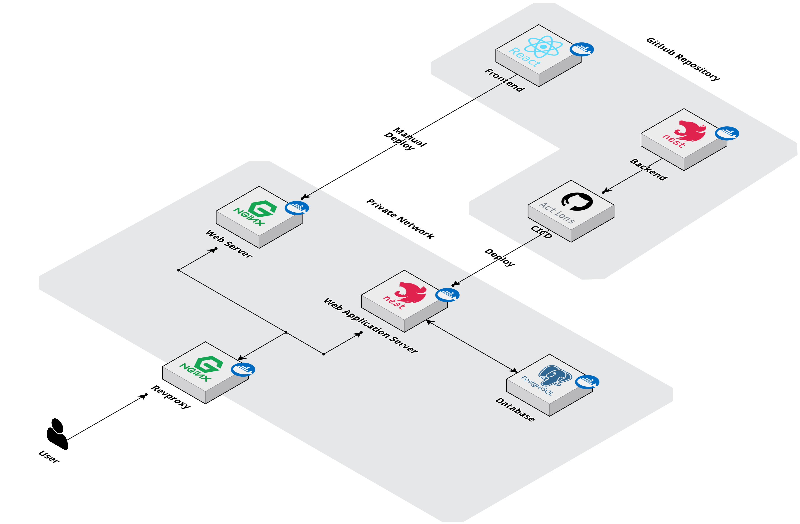

  

## Team metacog

2024년 동계 카카오 현장실습 깃허브 조직

**Mentor**

[Jenny](https://github.com/hyunjeeChoi) (Clean Platform CTO)

**Frontend Team**

[Richard](https://github.com/comgog) (Frontend Lead)

[Carter](https://github.com/Gukui0516) (Frontend Web Publisher)

**Backend Team**

[Shin](https://github.com/skynet3285) (Team Lead & Backend Lead)

[Kyle](https://github.com/yunsammy) (Database Lead)

  

## 프로젝트: 도파밈

PC 웹 애플리케이션 숏폼 스트리밍 플랫폼 서비스

## 프로젝트 목표

한달 내로 카카오 스페이스닷투에서 실전과 같은 프로젝트 경험하기

- 애자일하게 일하기(데일리스크럼과 스프린트)
- 개발을 위한 문서화(마인드맵 요구사항 정의, 기능명세서 정의, 피그마 와이어프레임과 디자인, API 명세서)
- 개발환경 설정(eslint와 prettier)과 빌드환경 설정(도커를 이용한 빌드환경 통일)
- CICD 구축

## 프로젝트 구성

[Dopameme-FE](https://github.com/2024-kakao-metacog/Dopameme-FE) : 웹 애플리케이션

[Dopameme-BE](https://github.com/2024-kakao-metacog/Dopameme-BE) : 웹 애플리케이션 서버

# 서비스 아키텍처

# 발표자료

**[Canva 발표 자료 보기](https://www.canva.com/design/DAGc_xVPfJc/Iz9oVp3XF-dL3U6CiE7GQw/edit?utm_content=DAGc_xVPfJc&utm_campaign=designshare&utm_medium=link2&utm_source=sharebutton)**
